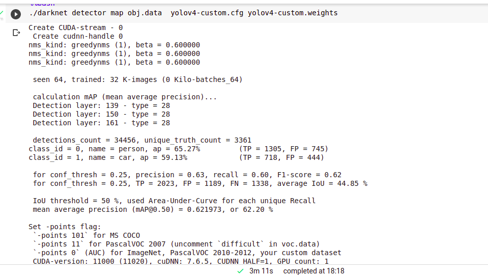

# Project details:

## Table of Contents:
- [Model name](https://github.com/Neelisha-saxena/yolov4_object_detection#model-name)
- [Explain About the model](https://github.com/Neelisha-saxena/yolov4_object_detection#explain-about-the-model)
- [Primary Analysis](https://github.com/Neelisha-saxena/yolov4_object_detection#primary-analysis)
- [Assumptions](https://github.com/Neelisha-saxena/yolov4_object_detection#assumptions)
- [Inference](https://github.com/Neelisha-saxena/yolov4_object_detection#inference)
- [False positives](https://github.com/Neelisha-saxena/yolov4_object_detection#false-positives)
- [Conclusion](https://github.com/Neelisha-saxena/yolov4_object_detection#conclusion)
- [Recommendations](https://github.com/Neelisha-saxena/yolov4_object_detection#recommendations)
- [Usage](https://github.com/Neelisha-saxena/yolov4_object_detection#usage)


### Model name:
Yolo v4 

### Explain About the model:
 
Due to its inplace data augmentation techniques during training and the benchmarks, I chose this model. I have already worked on Yolo earlier and hence a litle biased towards it. It is a 1-phase (classification and localisation at once) object detection model which does not require any region proposals. 

In a nutshell, it divides the image into grid and then assume k anchor boxes per cell of the grid. It then generates prediction (can be outside the grid as well) for every anchor box and then further uses NMS to reduce it down to final predictions.  

### Primary Analysis:
It's a small dataset with just 2 classes so I have gone through them and mentioned some of the key points under `Analysis` heading in Dataset_Analysis_Prep.ipynb

### Assumptions:
Since yolo assumes fixed number of anchor boxes per cell of the grid, hence it will fail if objects are very dense. In our case, it will not work well in crowd to detect persons but there was no sample with is_crowd True in training set so it is safely assumed to be the same at inference time.

### Inference:
To infer and make predictions from the model, please find the code section under `Inference` heading in Dataset_Analysis_Prep.ipynb
- Model is able to achieve 1.4 fps on core i5 cpu using python (it gets better when inference is done suign darknet)
- This is how the map progresses over iterations:


### False negative:
- Model is  missing some of the objects (can be found under `False negative example` heading in Dataset_Analysis_Prep.ipynb)
- It is also sometimes predicting seats inside the car as person when picture is taken from outside.\
- Person bboxes (Dense or small) are missed due to the underlying assumptions. 
- Detailed report of false positive, precision, recall and map can be seen in below image:


-model is trained only for 1100 iteration due to gpu contaraints. And its accuracy can be increased if rained with more number of iterartions.


### Conclusion:
This model is sufficient enough for the assignment purpose but for a produciton ready model, there are several things to do like 

- feed right data
  - more data collection
  - avoid labelling of objects which are very small that a human eye can find difficulty in identifying it
  - checking augmented images using -show_imgs flag
  - more robust augmentation technique to handle given occulusions
- hyperparameter optimisation

### Recommendations:
If dense objects are going to be there, then avoid this model and may be go for RetinaNet or the latest Swin Transformers.

### Usage:
Besides `yolo.py` file and `yolo_models` folder, use following code:

```
from yolo import yolo_load, yolo_detect, image_yolo_detect

yolov4 = yolo_load(model_name="yolov4-tiny")

detections = yolo_detect(yolov4, input_filepath=[img_path], 
                               confidence_threshold=0.5, 
                               yolo_width=416, 
                               yolo_height=416, 
                               save_output=True,
                                nms_threshold= 0.5)
```
